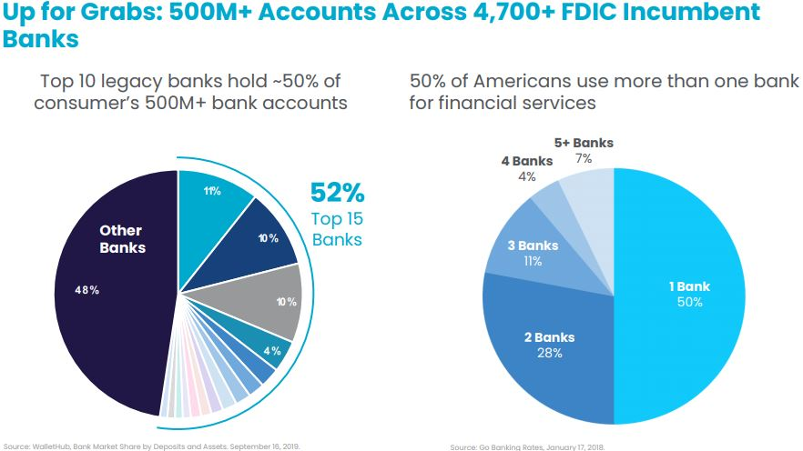
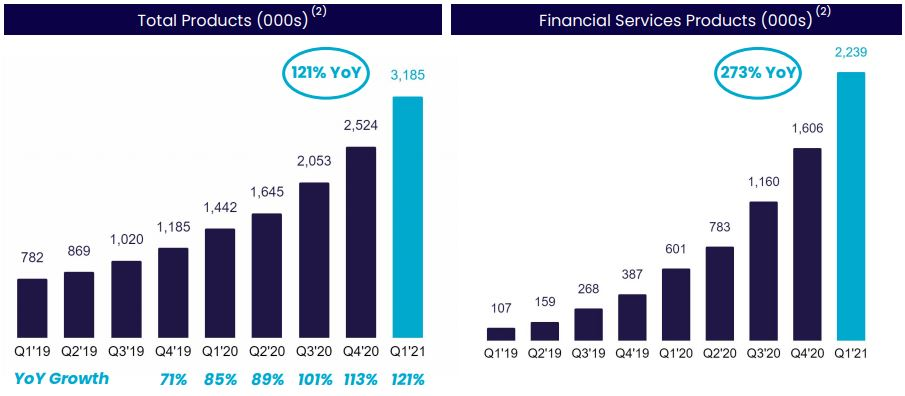

# **Homework #1** 
 

# FinTech Case Study: SoFi, Inc
## by: Franklin Vaca
### date: 06/19/2021 
---

*Homework #1 FinTech case study, SoFi, Inc was the company selected for the analysis. The readme file was written on Markdown. The analysis includes the text and images (tables and pictures).*

---

## **Overview and Origin**
### **Date of Incorporation:** May 2021  
### **Founders:**
  * Mike Cagney
  * Dan Macklin
  * James Finnigan
  * Ian Brady

### **Funding:**   
  * Initial seed capital: $2 Million
  * Current valuation: $8.7 Billion

### **SoFi's History:**  
SOFI, also known as Social Finance, Inc was founded in the year 2011 by Mike Cagney, Dan Macklin, James Finnigan and Ian Brady, who at the time, were graduate students at Stanford School of business. The initial goal was to provide an accessible and affordable funding alternative to students and graduates that have incurred debt to fund their education.

Time magazine(2012) reported that Stanford ran the pilot program to test the idea of this personal finance endeavor in 2011,  40 alumni contributed a total of $2 million dollars as the seed capital for the program. This initial funding was allocated among 85 students attending business graduate school. 

After seeing the success of the pilot program, SoFi extended their lending program nationally in 2012, to a total of 40 universities and an estimated $150 million allocated to student loans. This money was funded by the alumni. SoFi’s used the crowdsourcing lending model which allowed to considerably reduce the administrative fees of a traditional bank and those savings were passed to the customer (Okland, 2021).  In addition, SoFi had a low loan default rate (almost 0%, whereas the national average was 14%) thanks to reducing this risk by pairing students with alumni lenders. This "pairing" strategy gave the students the opportunity to leverage the skills and connections of their respective lenders which at the same time allowed them to better fulfill their loan obligations.

SoFi’s innovative strategy attracted different investors from the financial and private sectors, which allowed SoFi to raise $2.4 billion in equity and debt among those investors were: Peter Thiel, Soft Bank, Silver Lake, Third Point and Baseline Ventures. According to CNBC, SoFi’s valuation in May 2020 was $4.8 billion (CNBC, 2021). In April 2021, SoFi agreed to go public and was acquired by a SPAC (a Special Purpose Acquisition Company) led by Chamath Palihapitiya, raised $2.4 billion  and because of this merger SoFi was valued at $8.7 billion. 
>“The company is projecting adjusted net revenue of $3.7 billion by 2025 and earnings before interest, taxes, depreciation, and amortization (EBITDA) of $1.18 billion (The Motley Fool & Berkowitz, 2021)”.

## **Business Activities:**

### **What is SoFi trying to solve?**  

SoFi found that there is a segment of the population in need of financial services and tools to help them reach their financial goals.

Sofi’s website states that:
> “ SoFi’s mission is to help people reach financial independence to realize their ambitions”.

Sofi’s philosophy is based on four main pillars:
* Attack debt with a plan
* Have a safety net
* Put your money to work
* Save to achieve your financial goals

SoFi’s product offering is centered on providing tools that allow their customers to manage their finances. SoFi's business strategy is centered on becoming the “one stop shop” for personal finance for its members.

SoFi’s products are grouped in 3 different segments:
* Lending segment: 
   * Home loans
   * Personal loans
   * Student loans
* Financial services segment:
   * SoFi Money Accounts
   * SoFi Invest Accounts -  comprised of 3 types of products:
     * Active Investing Accounts
     * Robo-advisory accounts 
     * Cryptocurrency accounts
   * SoFi at work accounts
  * SoFi Credit Card accounts
  * SoFi Relay accounts (with credit monitoring and/or external accounts)
* Technology Platform Segment:
  * Galileo Accounts (excluding SoFi’s accounts)

The characteristics of SoFi's current product offering can be summarized as follows:
* SoFi Money – Cash management account that earns interests and no-account fees.
* SoFi Invest – Online investing in Stocks (whole and partial shares), ETFs and cryptocurrency with no commissions and reduced fees.
* Personal Loans – Low fixed personal loan rates without fees for up to $100,000 with unemployment protection.
* Credit Score and budgeting – SoFi Relay - Ability to track expenses, set financial goals and credit score monitoring.
* Student Loan Refinancing - Low fixed or variable rate student loans without application or origination fees.  
* Private Student Loans
* Home Loans - SoFi offers competitive rates, exclusive member discounts and has its own mortgage loan officers.
* Auto Loan Refinancing - low interest rates and no application fees
* SoFi Protect - Focused on providing insurance services.

### **Intended Customer:**
SoFi is targeting High Earners Not well served (HENWS) with ages over 22 years old and earnings over $100,000 per year. With that in mind, SoFi’s offering is based on a comprehensive suite of financial products and services in one app. SoFi leverages the data from its ecosystem of products across lending, financial services and payments processing to add potential new services or business opportunities to its portfolio.SoFi is also interested in attracted HENRY’s (High Earner Not Yet Rich), which can be grouped into two main categories:
* Millennials (born between 1980 and 2000) who make between  $100,000 and $200,000 annually
* Families that make $250,000 and $500,000 on an annual basis

One prominent characteristic in HENRY’s is that even though they earn high incomes they spend a good portion of it and have a small portion allocated to savings or income-producing investments (Social Finance, Inc, 2020). HENRY’s are usually defined as millennials, but there are also Gen X and Baby Boomers that fall within this category. 
> MarketResearch.com in 2016 estimated that 27 million US households belong to the HENRY's market segment.

### **Solutions that SoFi offers and its competitive advantage**
SoFi’s competitive advantage is based on their strategy:
> “A member experience and full suite of products that leverages the '*Financial Services Productivity Loop*' (or FSPL)” (Social Finance, Inc., 2021). 

SoFi’s CEO, Anthony Noto, defines FSPL as:
> “adjacent businesses and products that work together to create more value for the user base and more economic value for the shareholders” (Piper Sandler Companies, 2021). 

SoFi aims at building a relationship of trust and reliability through offering financial products and services that are member-centric.The individual success of each product is key and serves as a conduit for the customer to access the adjacent products.The first product leads the member to the next one which results in increasing the ***Lifetime Value (LTV)*** of each customer and decreasing the ***Customer Acquisition Cost (CAC)*** which increases revenue and is reflected into better unit economics. 

This allows SoFi to offer better interest rates in loans and savings and offer better products to the members which creates **SoFi’s competitive advantage: Being a one stop-shop for member-centric financial services and products that keep evolving thanks to the continuous engagement of its members.**
The products offered are intended to accompany the member throughout his/her entire financial life and satisfy his/her evolving financial needs.SoFi focuses its efforts on increasing customer engagement using newsletter, education, and rewards programs which will lead to additional cross-buy opportunities.

  
Source: SoFi Investor Presentation - January, 2020  

SoFi's app is the main hub where all the products and services are located, "the one and only stop" for the user.

 
Source: SoFi Investor Presentation - January, 2020
  
### **Technology:**
SoFi uses different types of technologies for each one of their products. Mobile banking is the main component for SoFi money. Additionally, SoFi uses API technologies to integrate its SoFi relay services. Artificial intelligence and machine learning are also part of SoFi’s set of tools in order to predict and customize the user experience in their app. 

During the last year and a half, SoFi made sizeable investments in order to enhance its capabilities:
* **Acquisition of Golden Pacific Bancorp:** This acquisition will accelerate its goal of achieving a bank charter. The company expects the bank charter to significantly streamline operations and add an additional $300 million of adjusted EBITDA to the company by 2025 for total EBITDA of nearly $1.5 billion that year” (The Motley Fool & Berkowitz, 2021). SoFi is interested in learning more about the small, local, regional banks in order to be able to create and offer services that can enhance the online presence of these small local institutions. Noto, in a recent interview, indicated that the acquisition of Golden Pacific Bancorp gives SoFi the incubation capability needed to develop products that can be useful for small, local financial institutions (Piper Sandler Companies & Repetto, 2021).   

* **Acquisition of Galileo:** Galileo is a payment software company that was acquired by SoFi in April 2020 for $1.2 billion (CNBC & Jeffery, 2020). SoFi acquired Galileo with the objective of leveraging Galileo’s current technology and enhancing the products and services offered by Galileo to reach a larger market share by creating more value to each one of Galileo’s customers. According to Anthony Noto (SoFi’s CEO) Galileo’s acquisition is crucial for the mid term goals of SoFi since Galileo’s technology can help accelerate the transition of physical payments and physical financial services to digital (Piper Sandler Companies & Repetto, 2021).

     
Source: SoFi Investor Presentation - January, 2020  

## **Landscape:**
### **FinTech domains:** 
Since SoFi aims at becoming a one stop solution for financial needs, SoFi 's footprint extends to  many FinTech domains: 
* Lending
* Online Banking and Personal Finance/Deposits/Online
* Insurance
* Investment Management and robo-advising
 
### **Major trends in the personal finance and banking domains over the last 10 years:** 
* *Open/challenger banking* - Fintech companies are challenging the status quo of the traditional banking system. Various fintech companies have developed platforms that allow financial institutions to connect to the broader API (Application programming interface) ecosystem which facilitates and speeds up transactions, while reducing costs at the same time.
* *Artificial intelligence (AI) and machine learning-powered (ML) platforms to manage core business processes*. The use of AI and ML technologies allow to read and analyze data and provide insights that support the decision-making process and or detect anomalies. These processes are usually characterized as data and paper intensive in the traditional setting. 
* *Personalized advice platforms*, from investment to lending. The development of products and services that are more member-centric supported by platforms created with the goal of improving  the customer experience.
* *Lending and crowdfunding platforms*. “The new generation of lending and crowdfunding platforms are marketplaces that help the two sides of the transaction (funder and funded, or creditor and debtor) by standardizing the process and helping with marketing and legal materials.” Additionally, these platforms have the ability to democratize the access to funding by presenting the user with several financial institutions where he/she can pick and choose the provider that better supports his/her needs. The impact of these technologies has benefited not only the personal loans segment but also the mortgages and real estate sectors.
* *Blockchain technology and cryptocurrencies*. The evolution of blockchain and the increasing use of cryptocurrencies all over the world are opening up new investment opportunities for investors to make transactions at a global scale. National governments, regulatory bodies and the financial sector have felt the increasing relevance of cryptocurrencies, smart contracts and blockchain technologies as new investment vehicles for users. 
* *Payment technologies:* The development of new payment technologies has made it more efficient for companies to move their money and has increased its potential markets to different parts of the world. “Ranging from cryptocurrencies to global account management and FX management, fintech in the payments industry offers a broad range of innovative solutions” (Toptal, LLC & Ketabchi, 2020).
* *Omnichannel and branchless banking:* Processes that used to be specific to branches are shifting to various digital channels: Online, social and mobile. The importance of this shift towards a more digital environment for the processes increased due to the pandemic. 
* *Smart Chip technology:* The addition of chips in credit and debit cards brought an additional layer of security which helped decrease the financial losses due to theft and fraud.

    
Source: Toptal, LLC and Ketbchi, N. (2020). State of Fintech Industry

### **Competition** 
SoFi's lending segment is one of the largest and most profitable for SoFi. The major competitors in the personal finance and consumer loans space (Toptal, LLC & Ketabchi, 2020) and (Craft. co, 2021)are:

* *Lending Club:* Online platform that connects creditworthy borrowers with savvy investors.
  * Over $60 billion borrowed
  * Over 3 million members
  * 2021 Q1 Revenue: $106 million
* *Avant:* Online platform and a provider of credit alternatives for middle income consumers.
  * Over $6.5 billion borrowed
  * Over 1.5 million members
* *Upstart:* Provider of cloud based artificial intelligence lending platform.
  * Over $10.8 billion borrowed
  * 2021 Q1 Revenue: $121 million
* *LendingTree:* Online marketplace that connects consumers with financial services
  * 2021 Q1 Revenue: $272 million
* *Chime:* Mobile-only bank offers no-fee checking and savings accounts
  * Privately held with a $5.8 billion valuation

The aforementioned companies are SoFi’s competitors on the personal finance and lending FinTech domains. `*Even though SoFi also offers products in other FinTech domains, SoFi's footprint in them is smaller.`
 
 Anthony Noto in SoFi’s investor relations meeting indicated that there are over 500 million bank accounts in the US and of those, 52% are tied to 15 legacy FDIC banks. The remaining 48% is fragmented over smaller banks, credit unions, regional and community banks. Also, over 50% of Americans use more than one bank for financial services. Noto sees a lot of potential for growth in SoFi’s future through providing mobile/digital services to those smaller and more local banks, and capturing more users from the traditional FDIC legacy banks. 

     
Source: SoFi Investor Presentation - January, 2020

## **Results**

* What has been the business impact of this company so far?

* What are some of the core metrics that companies in this domain use to measure success? How is your company performing, based on these metrics?

* How is your company performing relative to competitors in the same domain?

### **Impact of the Company:** 

SoFi is the leading student loan refinancing provider with over $30 billion dollars in refinanced student loans and more than 375 thousand members served. The majority of members that have used SoFi’s student loan refinancing services are willing to recommend it to his peers. A survey developed by SoFi between February and March 2019 found that of 1,642 members surveyed, 98% of participants would recommend SoFi to a friend (SoFi website, disclosures and disclaimers). Peer to peer recommendations along with their expenses in publicity via social media and traditional media have been successful at promoting the SoFi brand in the FinTech - Personal finance space.

### **Company Metrics** 
SoFi’s metrics tied to their Financial Services Productivity Loop (FSPL) strategy are:
  * Membership Growth
  * Products Growth
  * Growth in number of Accounts at Galileo

SoFi defines and measures each metric as follows:

* **Membership Growth:**   
  SoFi’s defines a member as:
  >“a member is someone who has a lending relationship with (SoFi) through origination or servicing, opened a financial services account, linked an external account to the platform, or signed up for our credit score monitoring service” (Social Finance, Inc website, 2021).

   SoFi’s membership growth rate is accelerated. SoFi has experienced 7 consecutive quarters of YoY (year-over-year) growth and had a 110% YOY increase for the first quarter of 2021.

        
   Source: SoFi’s Q1’21 Earnings Presentation

* **Product Growth in the financial and lending services segments:**

   Total products are defined as:
   >“the aggregate number of lending and financial services products that [the] members have selected on [the] platform since SoFi’s inception through the reporting date, whether or not the members are still registered for such products” (Social Finance, Inc., 2021) 

  SoFi had a 121% YoY growth in total products for Q1 in 2021 reaching 3.2 millions of total products sold during Q1. Products in the  financial services segment drove the growth with a 273% YoY growth (2.2 million products).

    
  Source: SoFi’s Q1’21 Earnings Presentation

* **Growth in number of Galileo Accounts:**

   Galileo is SoFi’s technology platform segment. This metric quantifies
    >“the number of open accounts at Galileo as of the reporting date, excluding SoFi accounts for periods subsequent to our acquisition of Galileo, as revenue generated by Galileo from the SoFi relationship is eliminated in consolidation” (Social Finance, Inc., 2021).

   Even though SoFi acquired Galileo, Galileo has a lot of operational independence. The number of accounts increased to 70 million in Q1 of 2021 reaching a 130% YoY growth for that quarter. 

      
   Source: SoFi’s Q1’21 Earnings Presentation

**Company Metrics Summary and Financial Performance by Segment**  

     
    
 Source: SoFi’s Q1’21 Earnings Presentation

**Internal metrics used at SoFi**

SoFi uses additional internal metrics in order to evaluate user engagement on the app:
* Daily active users
* Monthly active users
* L-3-7: Number of members that have used the product 3 times in the last 7 days. This number is multiplied by 4 (4 consecutive weeks) or by 3 (3 consecutive weeks)

These secondary metrics allow SoFi to have an idea of the number of the people that would walk into a branch every day if SoFi were to open a physical branch at any point in time. These internal metrics help SoFi have an indicator of  the potential store/branch traffic. 

SoFi is realtively a smaller player in the personal finance and financial consumer services domains. SoFi has been able to have an accelerated growth over the last 2 years. More established companies such as Lending Club, Avant and Upstart have larger market shares but the interconnectivity of SoFi's financial services and products allows the company to remain competitive in the arena. More established companies such as Robinhood, Chime, Paypal have started to add credit card services to their portfolio, which increases the competition in this segments for SoFi.

## **Recommendations**

SoFi still has a great potential for growth within the personal finance sector of the FinTech industry. THere are different steps that can be taken in order to increase market share either by capturing more accounts within the HENWS (or HENRY’s) market segment or by increasing the potential market size by increasing the group of users served.

* **Increase market share by improving the current offering via incorporating a service to eliminate silent fees.**  
  Additional accounts can be captured by providing additional services to the current product offering. An example would be the use of an app that parses through the user’s activity and identifies waste and save money on recurring payments that may not be relevant to the user (CBInsights, 2021). This technology was already developed on a personal finance app called Trim. 
  
  SoFi could incorporate this technology to its current offering to bring additional value to the consumer. Nowadays, many companies are using the subscription model and the user loses track of his/her expenditure on these subscription-based services. 
  > “A study conducted in 2018 found that the average consumer actually spent roughly 3x what they thought they did on subscriptions every month. Over time, these silent fees can result in hundreds of dollars being spent on services that consumers aren’t taking much advantage of — or using at all” (CBInsights, 2021).
  
   Similar technology could be developed by SoFi to create this silent fees sniffing app by using artificial intelligence in order to detect transactions that are repetitive. In addition, machine learning can be used to be able to debug and prevent the occurrence of similar transactions in the future. 
   The proceeds resulting from these savings could be used to fund additional services for the user within SoFi’s app. 

  The addition of this service to SoFi’s products aligns with SoFi’s philosophy of creating value to the user via the different products and also increases the lifetime value of the customer for the company.

* **Increase the size of the potential market by adding or reshaping current products to attract users in new market segments.**

  SoFi’s CEO Anthony Noto has indicated that one of the added benefits of the Galileo acquisition was that Galileo provides a product roadmap that will allow SoFi to develop new tech services and with that a geographic expansion to Latin America and Mexico (Social Finance, Inc., 2021). It will be important for SoFi to explore the local hispanic market in the US first, before launching an expansion strategy outside the US. 
  The Latino/hispanic segment in the US is sizable, 
  >“numbering over 62.8 million in 2020, Hispanics now represent 19% of the total U.S. population—making this group one of the fastest-growing population segments since 2000” (Claritas, LLC, 2020). 
  
  By “Beta-testing” the usage of the current products in the hispanic/latino market segment in the US will bring insights regarding the products characteristics and effective communication strategies to tap into this new market segment. The use of artificial intelligence and machine learning will allow SoFi to analyze how effective the current products are within the hispanic community and/or what changes need to be addressed to improve the customer experience. 

  Financial education is one of the added services that is extremely valuable for the user and also increases user engagement on the app. SoFi could use its infrastructure to analyze SoFi’s products' success in the Latino/Hispanic market and make the adaptations necessary to make them successful in this new market segment  using a more hispanic-centric approach. SoFi will be able to identify the needs of potential new financial products that could lead to a successful expansion later in the Mexican and Latin American markets.

## **Bibliography and Sources:**
* CBInsights. (2021, February 10). *We Analyzed 18 Of The Fastest-Growing Personal Finance Apps Of All Time To Figure Out The Secrets To Their Success — Here’s What We Learned*. Research Briefs. Retrieved June 17, 2021, from [https://www.cbinsights.com/research/personal-finance-apps-strategies/](https://www.cbinsights.com/research/personal-finance-apps-strategies/)

* Claritas, LLC. (2020). *The 2020 Hispanic Market Report*. Claritas, LLC., from [https://claritas.com/resources/2020-hispanic-market-report/](https://claritas.com/resources/2020-hispanic-market-report/)

* CNBC. (2021, May 06). *Disruptor 50 2020*. CNBC Markets. Retrieved June 17, 2021, from [https://www.cnbc.com/2020/06/16/sofi-disruptor-50.html](https://www.cnbc.com/2020/06/16/sofi-disruptor-50.html)

* CNBC & Jeffery, A. (2020, April 07). *SoFi to acquire payment software company Galileo for $1.2 billion*. CNBC Finance. Retrieved June 17, 2021, from [https://www.cnbc.com/2020/04/07/sofi-to-acquire-payment-software-company-galileo-for-1point2-billion.html](https://www.cnbc.com/2020/04/07/sofi-to-acquire-payment-software-company-galileo-for-1point2-billion.html)

* Craft.co. (2021). *SoFi Competitors*. SoFi competitors. Retrieved June 17, 2021, from [https://craft.co/sofi/competitors](https://craft.co/sofi/competitors) 

* MarketResearch.com. (2016, June). *Marketing Luxury in a Brand New Style for High-Earners-Not-Rich-Yet Consumers*. Marketing & Market Research. Retrieved June 17, 2021, from [https://www.marketresearch.com/Unity-Marketing-Inc-v642/Luxury-Brand-Style-High-Earners-10122661/](https://www.marketresearch.com/Unity-Marketing-Inc-v642/Luxury-Brand-Style-High-Earners-10122661/)

* The Motley Fool & Berkowitz, B. (2021, April 10). *Is SoFi the Growth Stock for You?* The Motley Fool. Retrieved June 17, 2021, from [https://www.fool.com/investing/2021/04/10/is-sofi-the-growth-stock-for-you/](https://www.fool.com/investing/2021/04/10/is-sofi-the-growth-stock-for-you/) 

* Okland, T. (2021, June 10). *SoFi Deep Dive: David becomes Goliath*. Seeking Alpha. Retrieved June 17, 2021, from [https://seekingalpha.com/article/4434163-numerous-catalysts-ahead-for-sofi](https://seekingalpha.com/article/4434163-numerous-catalysts-ahead-for-sofi)

 * Piper Sandler Companies & Repetto, R. (2021, June 10). *Piper Sandler Global Exchange & FinTech Conference* [Webcast]. Wall Street Webcasting. Retrieved June 17, 2021, from [https://wsw.com/webcast/pipersandler37/sofi/2929923](https://wsw.com/webcast/pipersandler37/sofi/2929923)
 
* Social Finance, Inc. (2020, October 29). *Investing as a HENRY (High Earner, Not Rich Yet)*. SoFi Learn. Retrieved June 17, 2021, from [https://www.sofi.com/learn/content/high-earner-not-rich-yet/](https://www.sofi.com/learn/content/high-earner-not-rich-yet/)

* Social Finance, Inc. (2021). *Disclosures and disclaimers*. SoFi.com. Retrieved June 06, 2021, from [https://www.sofi.com/legal/#recommend-sofi](https://www.sofi.com/legal/#recommend-sofi)

* Social Finance, Inc. (2021). *Refinance Student Loans.* SoFi.com. Retrieved June 14, 2021, from [https://www.sofi.com/refinance-student-loan/](https://www.sofi.com/refinance-student-loan/)

* Social Finance, Inc. (2021, January 06). *SoFi Investors'  Presentation*. SoFi Investor Relations. Retrieved June 17, 2021, from [https://s27.q4cdn.com/749715820/files/doc_presentation/2021/Project-Lightning_PIPE-Investor-Presentation_-SoFi-FINAL-(01.06.2021)2.pdf](https://s27.q4cdn.com/749715820/files/doc_presentation/2021/Project-Lightning_PIPE-Investor-Presentation_-SoFi-FINAL-(01.06.2021)2.pdf)

* Social Finance, Inc. (2021, May 31). *SoFi's Q1'21 Earnings Presentation*. SoFi Events and Presentations. Retrieved June 17, 2021, from [https://s27.q4cdn.com/749715820/files/doc_presentation/Q4_20_Summary_Results.pdf](https://s27.q4cdn.com/749715820/files/doc_presentation/Q4_20_Summary_Results.pdf)

* Time Magazine. (2012, April 02). *Student Loans For a Great Deal, Borrow from Alumni*. Time. Retrieved June 14, 2021, from [https://business.time.com/2012/04/02/student-loans-for-a-great-deal-borrow-from-alumni/](https://business.time.com/2012/04/02/student-loans-for-a-great-deal-borrow-from-alumni/)

* Toptal, LLC & Ketabchi, N. (2020). *State of the Fintech Industry (with Infographic)*. Toptal Finance. Retrieved June 17, 2021, from [https://www.toptal.com/finance/market-research-analysts/fintech-landscape](https://www.toptal.com/finance/market-research-analysts/fintech-landscape)

### FinTech Case Study: SoFi, Inc   
### Author: Franklin Vaca, 06/19/2021
